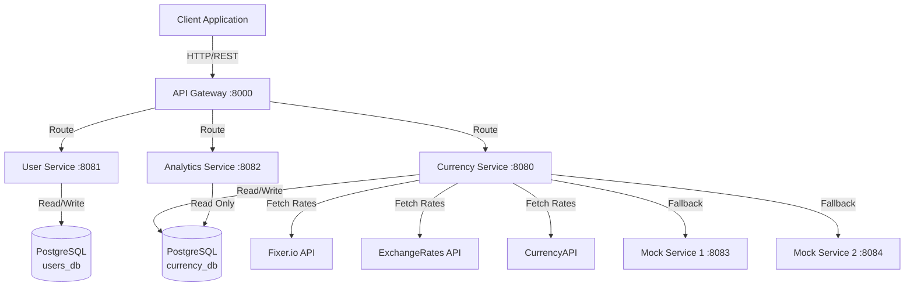
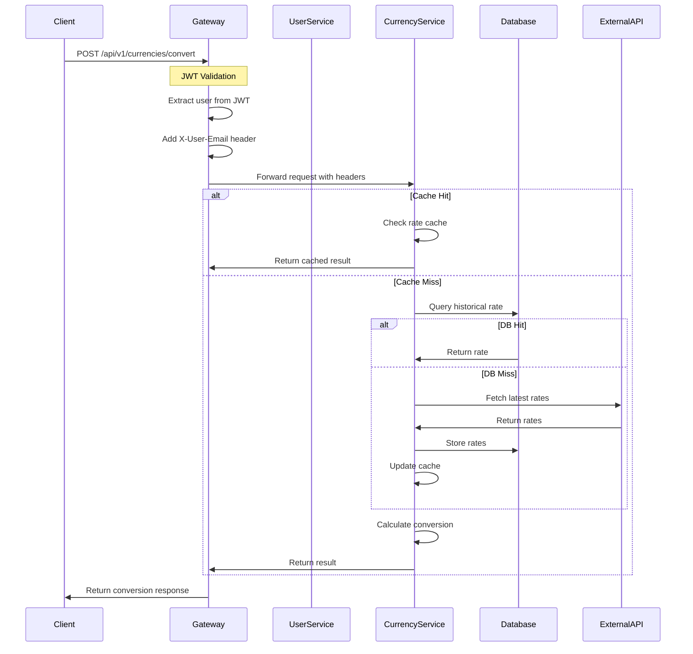
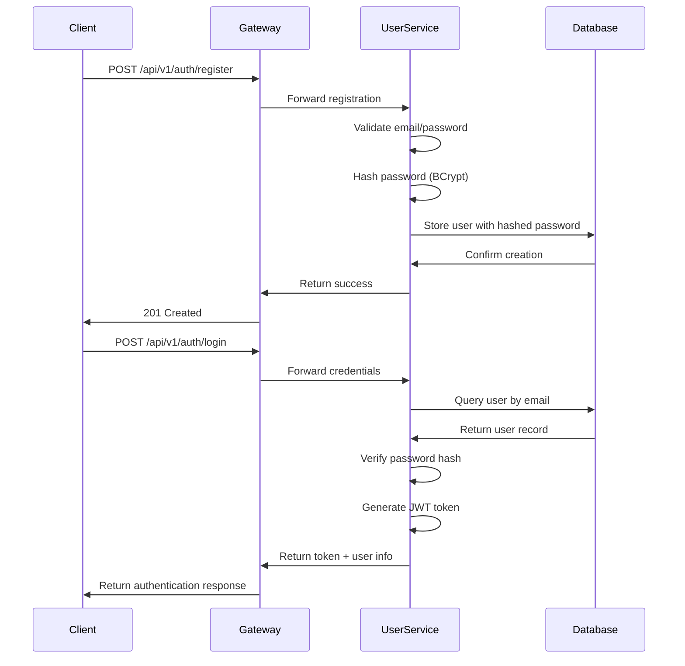
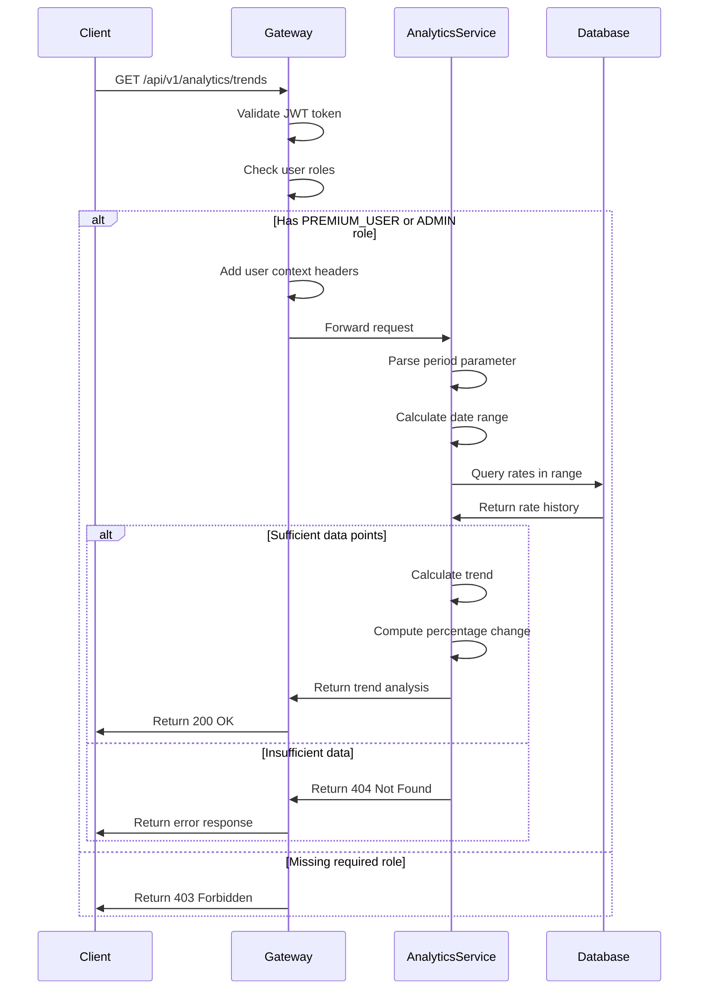

# System Architecture

This document describes the high-level architecture of the CERPS system, including component interactions, data flow, and design decisions.

## Architecture Overview

CERPS implements a microservices architecture pattern with the following key characteristics:

- Service decomposition by business capability
- Independent deployment units
- Decentralized data management
- API Gateway pattern for unified entry point
- JWT-based authentication and authorization

## System Context Diagram



## Component Architecture

### API Gateway

**Responsibilities:**
- Single entry point for all client requests
- JWT token validation
- Request routing to appropriate microservices
- Correlation ID generation for request tracing
- Cross-cutting concerns (CORS, headers propagation)

**Technology:**
- Spring Cloud Gateway
- Reactive programming model (Project Reactor)

**Port:** 8000

**Key Features:**
- Path-based routing to services
- JWT authentication filter
- User context propagation via headers (X-User-Email, X-User-Roles)
- Circuit breaker patterns
- Request/response logging with correlation IDs

### User Service

**Responsibilities:**
- User registration and authentication
- JWT token generation and validation
- User account management
- Password management
- Role-based access control

**Technology:**
- Spring Boot
- Spring Security
- JWT (jjwt library)
- BCrypt password encoding

**Port:** 8081

**Database:** PostgreSQL (users_db)

**Key Features:**
- Secure password hashing with BCrypt (strength 12)
- JWT tokens with 24-hour expiration
- Role-based authorization (USER, PREMIUM_USER, ADMIN)
- User account enable/disable functionality

### Currency Service

**Responsibilities:**
- Exchange rate aggregation from multiple providers
- Currency conversion calculations
- Supported currency management
- API provider key management with encryption
- Rate caching and scheduling

**Technology:**
- Spring Boot
- Spring Data JPA
- Liquibase for database migrations
- AES-256-GCM encryption for API keys
- Resilience4j for retry logic

**Port:** 8080

**Database:** PostgreSQL (currency_db)

**Key Features:**
- Multi-provider rate aggregation with median calculation
- Fallback to mock services on provider failures
- In-memory rate caching (TTL: 1 hour)
- Scheduled rate updates (hourly)
- Cross-rate calculation when direct rate unavailable
- API key encryption at rest

### Analytics Service

**Responsibilities:**
- Historical trend analysis
- Currency pair performance metrics
- Percentage change calculations over time periods

**Technology:**
- Spring Boot
- Spring Data JPA (read-only access)

**Port:** 8082

**Database:** PostgreSQL (currency_db) - Read-only access

**Key Features:**
- Time-based trend queries (7D, 30D, 1M, 3M, 6M, 1Y)
- Percentage change calculations
- Data point aggregation
- Premium user access control

### Mock Services

**Responsibilities:**
- Fallback exchange rate providers
- High availability when external APIs fail
- Testing and development support

**Technology:**
- Spring Boot
- Random rate variation (±10-15% from base rates)

**Ports:** 8083, 8084

**Key Features:**
- Simulated exchange rate responses
- Fixer.io-compatible response format
- Configurable rate volatility

## Data Flow Diagrams

### Request Flow - Currency Conversion



### Request Flow - Authentication



### Request Flow - Analytics Trends



## Data Architecture

### Database Schema - User Service

**users_db:**

```
users
├── id (BIGINT, PK)
├── email (VARCHAR, UNIQUE)
├── password (VARCHAR, BCrypt hash)
├── enabled (BOOLEAN)
├── created_at (TIMESTAMP)
└── updated_at (TIMESTAMP)

roles
├── id (BIGINT, PK)
├── name (VARCHAR, UNIQUE)
└── created_at (TIMESTAMP)

user_roles (Join Table)
├── user_id (BIGINT, FK)
└── role_id (BIGINT, FK)
```

**Default Roles:**
- ROLE_USER - Standard user access
- ROLE_PREMIUM_USER - Access to analytics features
- ROLE_ADMIN - Full system access

### Database Schema - Currency Service

**currency_db:**

```
supported_currencies
├── id (BIGINT, PK)
└── currency_code (VARCHAR(3), UNIQUE)

exchange_rates
├── id (UUID, PK)
├── base_currency (VARCHAR(3))
├── target_currency (VARCHAR(3))
├── rate (DECIMAL(20,10))
├── source (VARCHAR(20))
└── timestamp (TIMESTAMP)

api_provider_keys
├── id (BIGINT, PK)
├── provider_name (VARCHAR(50), UNIQUE)
├── encrypted_api_key (TEXT)
├── active (BOOLEAN)
├── created_at (TIMESTAMP)
└── updated_at (TIMESTAMP)
```

**Indexes:**
- `idx_latest_rate` on (base_currency, target_currency, timestamp DESC)
- `idx_trends` on (base_currency, target_currency, timestamp)
- `idx_timestamp` on (timestamp)

## Security Architecture

### Authentication Flow

1. Client submits credentials to `/api/v1/auth/login`
2. User Service validates credentials against hashed password
3. User Service generates JWT token with user email and roles
4. Token returned to client with 24-hour expiration
5. Client includes token in Authorization header for subsequent requests
6. API Gateway validates token and extracts user context
7. Gateway propagates user information via headers to downstream services

### Authorization Model

**Role Hierarchy:**
```
ADMIN > PREMIUM_USER > USER
```

**Endpoint Access:**

| Endpoint | USER | PREMIUM_USER | ADMIN |
|----------|------|--------------|-------|
| POST /auth/register | Public | Public | Public |
| POST /auth/login | Public | Public | Public |
| GET /auth/me | Yes | Yes | Yes |
| GET /currencies | Yes | Yes | Yes |
| POST /currencies | No | No | Yes |
| POST /currencies/convert | Yes | Yes | Yes |
| POST /currencies/refresh | No | No | Yes |
| GET /analytics/trends | No | Yes | Yes |
| POST /admin/** | No | No | Yes |

### Security Features

**JWT Token:**
- HS256 algorithm (HMAC with SHA-256)
- 256-bit secret key
- Claims: subject (email), roles, issued-at, expiration

**Password Security:**
- BCrypt hashing with strength 12
- Minimum complexity requirements enforced
- Stored as hash only, never plain text

**API Key Security:**
- AES-256-GCM encryption at rest
- 256-bit master key
- 96-bit initialization vector per key
- Keys cached post-decryption for performance

**Network Security:**
- Stateless sessions (no server-side state)
- CORS configuration
- Request validation
- SQL injection prevention via parameterized queries

## Scalability Considerations

### Horizontal Scaling

Each service can be independently scaled:

```
Client → Load Balancer → [Gateway Instance 1]
                       → [Gateway Instance 2]
                       → [Gateway Instance N]

Gateway → [Currency Service Instance 1]
        → [Currency Service Instance 2]
        → [Currency Service Instance N]
```

**Considerations:**
- Stateless service design enables horizontal scaling
- Database connection pooling per instance
- Shared PostgreSQL with read replicas for analytics
- Cache coherency required for multi-instance currency service

### Performance Optimization

**Caching Strategy:**
- In-memory cache for exchange rates (1-hour TTL)
- Database query result caching
- Decrypted API key caching

**Database Optimization:**
- Indexes on frequent query patterns
- Read-only analytics database user
- Automatic cleanup of old exchange rate records (>395 days)

**External API Optimization:**
- Resilience4j retry with exponential backoff
- Circuit breaker pattern for failing providers
- Median calculation across multiple providers
- Fallback to mock services

## Monitoring and Observability

### Correlation ID

All requests receive a correlation ID:
- Generated by API Gateway if not present
- Propagated through all service calls
- Included in all log statements
- Returned in response headers

Format: UUID v4

### Health Checks

Each service exposes actuator endpoints:

```
GET /actuator/health
```

Response:
```json
{
  "status": "UP",
  "components": {
    "db": {"status": "UP"},
    "diskSpace": {"status": "UP"}
  }
}
```

### Metrics

Prometheus metrics available at:

```
GET /actuator/prometheus
```

**Key Metrics:**
- Request count and latency
- Database connection pool stats
- Currency conversion success/failure rates
- User registration/login counts
- External API call success rates

### Logging

Structured logging format:
```
YYYY-MM-DD HH:mm:ss [service-name] [correlationId] LEVEL logger - message
```

Example:
```
2024-12-19 14:30:00 [currency-service] [a1b2c3d4-5678-90ef-1234-567890abcdef] INFO  c.e.c.s.CurrencyService - Converting 100 USD to EUR
```

## Deployment Architecture

### Docker Compose Deployment

Services deployed as Docker containers:

```
cerps-network (bridge)
├── postgres-users (PostgreSQL 15)
├── postgres-currency (PostgreSQL 15)
├── user-service
├── currency-service
├── analytics-service
├── mock-service-1
├── mock-service-2
└── api-gateway
```

**Resource Limits:**
- PostgreSQL: 256MB memory, 0.5 CPU
- Services: 384-512MB memory, 0.75-1.0 CPU
- Mock Services: 256MB memory, 0.5 CPU

### Environment Variables

Required configuration:
- `JWT_SECRET` - Base64-encoded 256-bit key
- `ENCRYPTION_MASTER_KEY` - Base64-encoded 256-bit key
- `POSTGRES_PASSWORD` - Database passwords
- `FIXER_API_KEY` - External API keys
- `EXCHANGERATES_API_KEY`
- `CURRENCYAPI_KEY`

## Design Decisions

### Microservices vs Monolith

**Decision:** Microservices architecture

**Rationale:**
- Independent scaling of currency rate fetching
- Separation of concerns (auth, conversion, analytics)
- Technology flexibility per service
- Independent deployment cycles

**Trade-offs:**
- Increased operational complexity
- Network latency between services
- Distributed transaction challenges

### Database per Service

**Decision:** Separate databases for user and currency services

**Rationale:**
- Data ownership boundaries
- Independent schema evolution
- Service autonomy
- Analytics read-only access pattern

### API Gateway Pattern

**Decision:** Centralized API Gateway

**Rationale:**
- Single public endpoint
- Centralized authentication
- Cross-cutting concerns in one place
- Simplified client integration

**Trade-offs:**
- Single point of failure
- Potential bottleneck
- Additional network hop

### JWT Stateless Authentication

**Decision:** JWT tokens instead of sessions

**Rationale:**
- Stateless (no server-side session storage)
- Horizontal scalability
- Self-contained authentication
- Reduced database load

**Trade-offs:**
- Token revocation complexity
- Larger payload than session ID
- Client-side token management

### Median Rate Calculation

**Decision:** Aggregate multiple providers with median calculation

**Rationale:**
- Eliminates outlier rates
- More accurate than single provider
- Reduces impact of provider errors
- High availability through redundancy

**Trade-offs:**
- Increased API calls
- Additional complexity
- Higher latency

## Future Considerations

### Potential Enhancements

- Redis cache for distributed caching
- Kafka for event-driven architecture
- Kubernetes deployment
- Service mesh (Istio/Linkerd)
- API versioning strategy
- Rate limiting per user
- WebSocket support for real-time rates
- Multi-region deployment

### Scalability Limits

Current architecture can handle:
- ~1000 requests per second (single instance)
- ~10,000 concurrent users
- ~100 million exchange rate records

Scaling beyond requires:
- Database sharding
- CDN for static content
- Caching layer (Redis)
- Load balancer configuration
- Message queue for async operations
